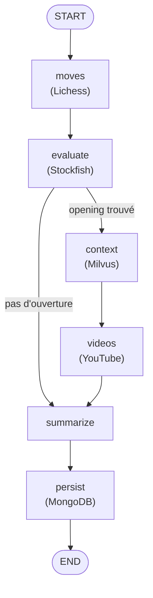
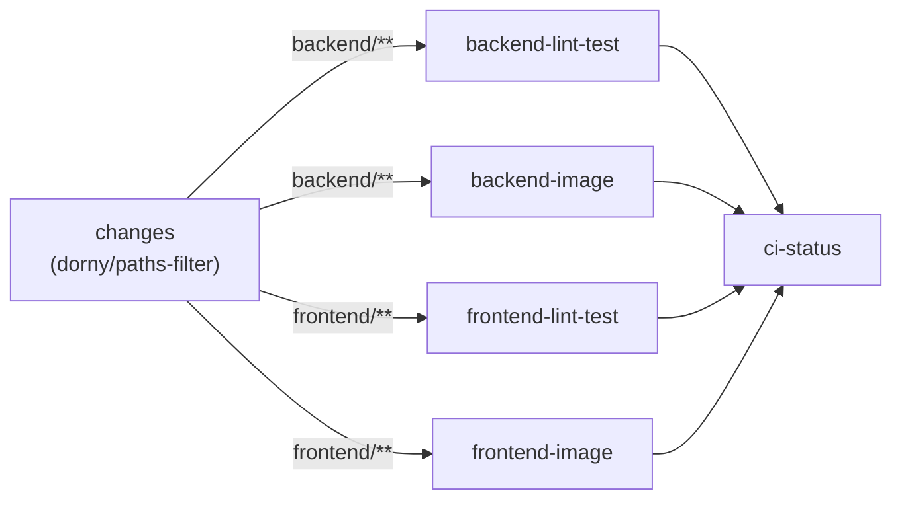

# Architecture technique de l'agent

Ce document explique **comment fonctionne l'agent**, en complément du
[README](../README.md) (installation, usage) et de la
[procédure de test manuel](tests-manuels.md) (vérification, incidents). Il
s'adresse à quiconque doit modifier le backend ou comprendre pourquoi il se
comporte d'une certaine façon.

## 1. Vue d'ensemble en couches

```
api/v1/      Contrat HTTP : validation de la FEN, codes d'erreur, sérialisation.
             Ne contient aucune logique métier — délègue à graph/ et services/.

graph/       Orchestration LangGraph : décide QUELLES sources interroger et
             DANS QUEL ORDRE pour une position donnée, agrège leurs résultats.

services/    Un client par source externe (Lichess, Stockfish, Milvus,
             YouTube, MongoDB, embeddings). Chacun connaît son protocole
             (HTTP, subprocess, driver...) et convertit ses erreurs en une
             exception métier dédiée (LichessError, StockfishError, ...).

schemas/     Contrats Pydantic (requêtes/réponses), partagés par les couches
             au-dessus.

core/        Configuration (variables d'environnement), logging, traçage.
```

Aucune couche ne « saute » par-dessus une autre : la route `/analyze`
(`app/api/v1/analyze.py`) ne connaît pas `httpx` ni `stockfish`, elle appelle
le graphe compilé et sérialise son état final.

## 2. Le graphe LangGraph



Six nœuds (`app/graph/agent_graph.py`), un état partagé (`AgentState`,
`TypedDict`) et **un seul aiguillage conditionnel** :
`_route_after_evaluate`, qui envoie vers `context` (Milvus) + `videos`
(YouTube) si Lichess a nommé une ouverture, sinon directement vers
`summarize`. C'est le mécanisme qui décide de la source pertinente pour une
position :

- **position dans la théorie** (Lichess renvoie des coups) → la recommandation
  s'appuie sur ces coups théoriques ;
- **position hors théorie** (aucun coup connu) → la recommandation s'appuie
  sur `evaluation.best_move`, produit par Stockfish, qui tourne de toute façon
  sur **chaque** position (`moves → evaluate` est une arête simple, pas
  conditionnelle) pour garantir qu'une évaluation est toujours disponible.

### Comment une position est identifiée ou non

Lichess ne reconnaît pas une ouverture en comparant les coups joués à un
répertoire connu : `_moves` (`app/graph/agent_graph.py:116-146`) envoie la
FEN **courante** à son explorateur de parties de maîtres, qui répond soit des
coups déjà joués depuis **cette position exacte** avec son nom, soit une
liste vide si aucune partie de sa base n'y est jamais passée. `in_theory`
vaut `bool(response.moves)` : « identifiée » signifie littéralement « cette
position existe dans la base », pas « ça ressemble à une ouverture connue ».

Conséquence pour l'utilisateur : dès qu'un coup s'écarte de ce que jouent les
maîtres, la position résultante n'a presque aucune chance d'avoir déjà été
atteinte — et comme les échecs se ramifient combinatoirement, chaque position
suivante en dépend entièrement. **Rester hors théorie après un premier coup
surprenant est donc le comportement normal**, pas un défaut de détection ;
seule une **transposition** (retomber par un autre enchaînement de coups sur
une position connue) y ramène.

Un même symptôme visuel (bandeau « hors théorie », cartes contexte/vidéos
absentes) peut avoir deux causes très différentes, à distinguer via
`sources.lichess` dans les « Détails techniques » de l'interface :

| Cause | `sources.lichess` | Ce qui s'est passé |
|-------|--------------------|--------------------|
| Position hors de la base de maîtres (cas normal) | `{"ok": true}` | Lichess a répondu normalement, avec une liste vide — une vraie réponse, pas un échec |
| Panne réelle (Lichess injoignable, token invalide, timeout) | `{"ok": false, "detail": "..."}` | `LichessError` capturée (voir § Dégradation gracieuse ci-dessous) ; `in_theory`/`theoretical_moves` prennent les mêmes valeurs par défaut que le cas normal |

Dans les deux cas, Stockfish (`evaluate`) a de toute façon déjà tourné sur la
position : la recommandation bascule sur son meilleur coup plutôt que de
laisser l'utilisateur sans réponse.

### État partagé (`AgentState`)

| Champ | Rempli par | Rôle |
|-------|-----------|------|
| `fen` | entrée | Position à analyser |
| `opening`, `theoretical_moves`, `in_theory` | `moves` | Théorie Lichess |
| `evaluation` | `evaluate` | Évaluation Stockfish |
| `context` | `context` | Passages Wikichess (Milvus) |
| `videos` | `videos` | Vidéos YouTube |
| `summary` | `summarize` | Recommandation en langage courant |
| `sources` | tous | État (`ok`/`detail`) de chaque source consultée |

`sources` utilise un réducteur dédié (`_merge_sources`) déclaré via
`Annotated[dict, _merge_sources]` : chaque nœud ne renvoie que **sa propre**
clé, LangGraph fusionne automatiquement les mises à jour successives plutôt
que d'écraser l'état.

### Dégradation gracieuse

Chaque nœud qui appelle une source externe capture **sa propre** exception
métier et renvoie un état dégradé au lieu de laisser l'exception remonter :

```python
try:
    evaluation = await run_in_threadpool(stockfish_service.evaluate, state["fen"])
    return {"evaluation": evaluation, "sources": {"stockfish": SourceStatus()}}
except StockfishError as exc:
    return {"sources": {"stockfish": SourceStatus(ok=False, detail=str(exc))}}
```

Conséquence : la panne d'**une** source ne casse jamais `/analyze` — elle
apparaît uniquement dans `sources.<nom>.ok = false`, avec un message
explicite dans `detail`. C'est la promesse vérifiée par les tests 30-32 de la
[procédure de test manuel](tests-manuels.md#8-tests-de-résistance-aux-pannes).

## 3. Cache et historique (MongoDB)

Les réponses Lichess et YouTube sont mises en cache par position/ouverture
(TTL 24 h, `app/graph/cache.py`) : l'interface relance une analyse à **chaque
coup joué**, sans cache les quotas (YouTube en particulier, 100 unités par
recherche) seraient vite épuisés. Une panne MongoDB ne bloque ni le cache ni
l'historique : les appels sont simplement refaits sans être mémorisés (voir
`sources.mongo`).

## 4. Recherche vectorielle (RAG Wikichess → Milvus)

`app/scripts/ingest.py` découpe les articles Wikichess (`backend/data/wikichess/`)
en passages, fusionne les paragraphes trop courts et scinde les trop longs
(`MIN_CHUNK_CHARS` / `MAX_CHUNK_CHARS`), les encode avec
`Qwen/Qwen3-Embedding-0.6B` (`sentence-transformers`) et les insère dans une
collection Milvus (métrique cosinus). Le nœud `context` interroge plus large
que ce qu'il affiche puis ne garde que les passages d'**une seule** fiche
(`keep_best_source`, `app/graph/retrieval.py`), pour éviter de mélanger deux
ouvertures dans une même réponse.

**Choix assumé : pas de génération par LLM.** Les consignes du projet
(`CONSIGNES.md`, étape 3) demandent que LangGraph « orchestre l'appel Milvus
**et formate la réponse** » — pas qu'un modèle génère du texte à partir des
passages récupérés. L'agent renvoie donc les extraits Wikichess tels quels
(`context: list[RetrievedChunk]`), affichés par l'interface avec leur
provenance. Ajouter une étape de synthèse par LLM serait sorti du périmètre
demandé (`CONSIGNES.md` §8 : « ne pas faire plus que demandé »).

## 5. Observabilité

Trois outils indépendants, chacun pouvant être absent sans casser l'agent :

### Logs structurés (JSON)

`app/core/logging.py` configure le logger racine pour émettre une ligne JSON
par log sur la sortie standard (récupérable via `docker compose logs
backend`). Deux sources :

- `app.request` : une ligne par requête HTTP (`method`, `path`, `status_code`,
  `duration_ms`), ajoutée par un middleware dans `app/main.py` ;
- `app.graph` : une ligne par nœud du graphe exécuté (`node`, `fen`,
  `duration_ms`, `ok`), ajoutée par le décorateur `_traced` dans
  `agent_graph.py`.

Exemple :

```json
{"timestamp": "...", "logger": "app.graph", "level": "INFO", "message": "graph_node", "node": "evaluate", "fen": "rnbq...", "duration_ms": 340.2, "ok": true}
```

Niveau réglable via `LOG_LEVEL` (défaut `INFO`).

### Métriques Prometheus

`prometheus-fastapi-instrumentator` expose `GET /metrics` (requêtes HTTP par
route/code, histogrammes de latence, métriques processus Python). Aucun
service de collecte (Prometheus server, Grafana) n'est fourni dans ce POC :
l'endpoint est prêt à être scrappé si l'infrastructure cible en dispose.

### Traçage MLflow (best effort)

Un service `mlflow` (docker-compose) expose une UI sur
`http://localhost:5000` (`${MLFLOW_PORT:-5000}`), backée par SQLite dans un
volume nommé (`mlflow_data`). `app/graph/agent_graph.py` instrumente
manuellement le graphe avec `mlflow.trace()` (une fonction `run_agent`
englobante pour une trace parente nommée `analyze`, plus un span par nœud via
le décorateur `_traced`) — chaque appel à `/analyze` produit ainsi une trace
consultable dans l'UI, avec entrées/sorties et durée par nœud.

> **Pourquoi pas `mlflow.langchain.autolog()` ?** Tenté en premier, mais cet
> autolog importe inconditionnellement le paquet `langchain` complet (au-delà
> de `langchain-core`, déjà installé par LangGraph) pour sa seule vérification
> de version — absent de ce projet, il levait `ModuleNotFoundError` à chaque
> démarrage (visible en `mlflow_tracking_unavailable`). L'instrumentation
> manuelle évite cette dépendance sans rapport avec la stack réellement
> utilisée.

C'est explicitement une **surveillance best effort**, pas une dépendance dure —
vérifié en coupant le conteneur `mlflow` pendant qu'un `/analyze` était en
cours : la requête aboutit normalement (200, cinq sources à `ok: true`), sans
ralentissement ni erreur, l'export des spans échouant silencieusement côté
SDK MLflow :

- si `MLFLOW_TRACKING_URI` n'est pas configuré, ou si le serveur est
  injoignable, `configure_tracking()` le journalise (`mlflow_tracking_disabled`
  / `mlflow_tracking_unavailable`) et l'application démarre normalement ;
- dans `docker-compose.yml`, le backend attend que `mlflow` soit **démarré**
  (`condition: service_started`), pas **sain** (`service_healthy`) — une
  panne de MLflow ne doit jamais retarder ni bloquer le démarrage du backend.

## 6. CI/CD

### GitHub Actions (`.github/workflows/ci.yml`)



Deux optimisations pour un retour rapide sur chaque push/PR vers `main` :

1. **Filtrage par chemin** (job `changes`, `dorny/paths-filter`) : les jobs
   backend ne se déclenchent que si `backend/**` a changé, les jobs frontend
   que si `frontend/**` a changé. Une PR qui ne touche que la documentation ne
   déclenche donc aucun job coûteux.
2. **Parallélisme complet** : `backend-lint-test`, `backend-image`,
   `frontend-lint-test` et `frontend-image` démarrent tous en même temps (pas
   de `needs` entre eux) — la durée totale du pipeline est celle du plus long
   job, pas leur somme. Un job `ci-status` final agrège leurs résultats : c'est
   lui qu'il faut désigner comme *required check* dans les règles de
   protection de branche GitHub, car les autres jobs, étant conditionnels,
   apparaissent comme absents (et non échoués) quand ils sont ignorés — un
   *required check* ne sait pas interpréter cette absence.

Le cache `uv` (clé sur `backend/uv.lock`) et le cache de couches Buildx
(`type=gha`) évitent de retélécharger/recompiler torch et les dépendances de
`sentence-transformers`/MLflow à chaque run tant que les fichiers de
dépendances n'ont pas changé.

### Règles avant push (hook local)

`.githooks/pre-push` reproduit localement les mêmes vérifications (ruff,
pytest, tests Angular), uniquement sur ce qui a changé depuis `origin/main` —
pour échouer en quelques secondes plutôt qu'en attendant la CI distante.
Activation (une fois par clone) :

```bash
git config core.hooksPath .githooks
```

Non activé par défaut : `git config core.hooksPath` reste une préférence
locale par clone, git ne permet pas de l'imposer depuis un fichier versionné.
