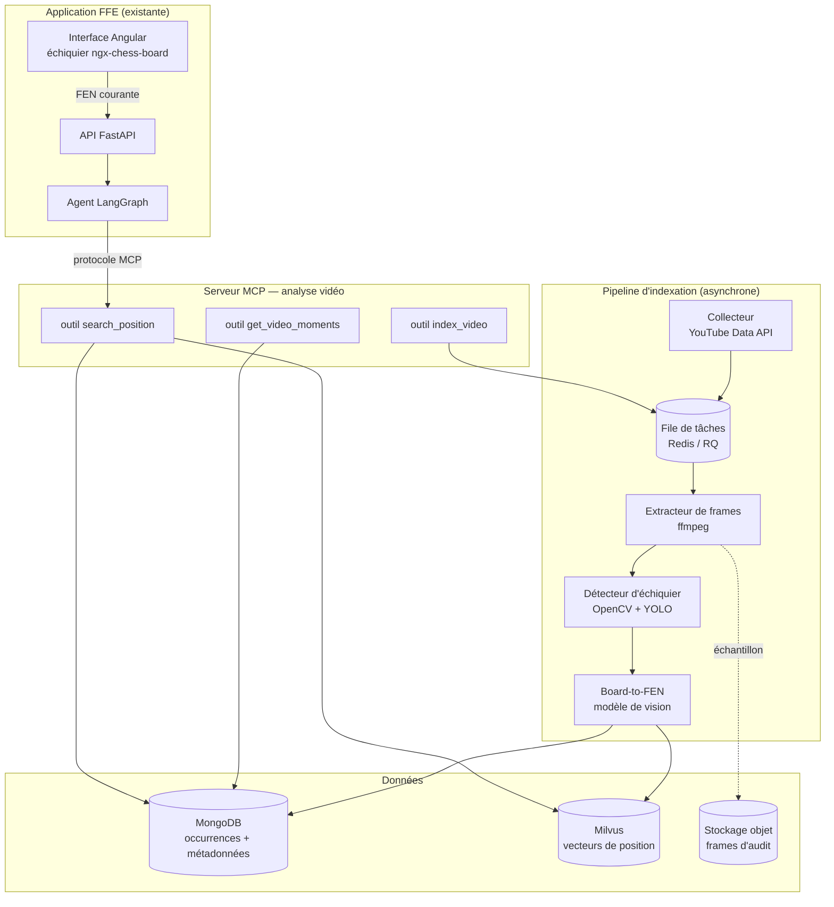

# Note — Système avancé d'analyse vidéo par la position

**Recherche d'une position exacte dans un catalogue de vidéos, exposée via un
serveur MCP**

Fédération Française des Échecs — POC agent IA ouvertures
Livrable 2 · Note bénéfices, limites, architecture et faisabilité
Juillet 2026

---

## Sommaire

1. [Le problème à résoudre](#1-le-problème-à-résoudre)
2. [Le système proposé](#2-le-système-proposé)
3. [Architecture technique](#3-architecture-technique)
4. [Pourquoi un serveur MCP](#4-pourquoi-un-serveur-mcp)
5. [Bénéfices attendus](#5-bénéfices-attendus)
6. [Limites et risques](#6-limites-et-risques)
7. [Étude de faisabilité et coûts](#7-étude-de-faisabilité-et-coûts)
8. [Alternatives évaluées](#8-alternatives-évaluées)
9. [Roadmap proposée](#9-roadmap-proposée)
10. [Recommandation](#10-recommandation)

---

## 1. Le problème à résoudre

### 1.1 Ce que fait le POC aujourd'hui

Dans la version actuelle de l'agent, la recommandation de vidéos repose sur une
**requête textuelle** envoyée à l'API YouTube Data v3 : le nom de l'ouverture
identifiée par l'explorateur Lichess, complété par des mots-clés
(« chess opening tutorial explanation »).

Cette approche a le mérite d'être immédiate et quasi gratuite, mais elle
souffre d'un défaut structurel : **la granularité**. L'utilisateur qui vient de
jouer le 6ᵉ coup d'une variante Najdorf reçoit une vidéo de 45 minutes intitulée
« La défense sicilienne expliquée ». La réponse est thématiquement correcte et
pédagogiquement inutile : le jeune joueur devra parcourir la vidéo à la
recherche du moment où sa position apparaît — s'il y apparaît.

### 1.2 Le décalage entre la question et la réponse

La question réellement posée par l'utilisateur n'est pas « parle-moi de la
sicilienne » mais « **pourquoi ce coup-ci, dans cette position-ci** ». Le
système actuel répond au niveau de l'**ouverture** ; l'utilisateur interroge au
niveau de la **position**.

Or l'ouverture est une abstraction : deux positions relevant de la même
ouverture peuvent appeler des explications totalement différentes. À l'inverse,
une même position peut être atteinte par des ordres de coups différents
(transpositions) et relever nominalement de plusieurs ouvertures.

**La position (FEN) est l'unité de sens pertinente.** C'est déjà le pivot de
notre agent pour Lichess et Stockfish ; ce n'est pas encore le cas pour la
vidéo.

### 1.3 Ce que nous voulons obtenir

> Pour la position courante, renvoyer une ou plusieurs vidéos **avec le
> timestamp précis** où cette position est affichée à l'écran et commentée.

Le lien renvoyé n'est plus `youtube.com/watch?v=XYZ` mais
`youtube.com/watch?v=XYZ&t=734s` — et l'utilisateur tombe directement sur
l'explication de **sa** position.

---

## 2. Le système proposé

### 2.1 Principe

Le système inverse la logique : au lieu de chercher une vidéo au moment où
l'utilisateur pose sa question, on **indexe à l'avance** le contenu visuel des
vidéos pour pouvoir y chercher une position exacte.

Le traitement se fait en quatre temps :

| Étape | Traitement | Sortie |
|-------|-----------|--------|
| 1. Collecte | Sélection et téléchargement des vidéos pédagogiques pertinentes | Fichiers vidéo + métadonnées |
| 2. Échantillonnage | Extraction d'images à intervalle régulier (1 image / 2 s) | Frames |
| 3. Détection | Repérage d'un échiquier dans la frame, recadrage et redressement | Image d'échiquier normalisée |
| 4. Transcription | Conversion de l'image en notation FEN par un modèle de vision | `(video_id, timestamp, FEN)` |

Le résultat est un **index position → moments de vidéo**, interrogeable en
temps réel par l'agent.

### 2.2 Le point délicat : la recherche par position

Une recherche par égalité stricte sur la chaîne FEN serait fragile : un
timestamp décalé d'une demi-seconde, une pièce en cours de déplacement, une
erreur du modèle sur une seule case, et la correspondance est manquée.

Deux mécanismes se complètent :

1. **Clé exacte** sur le champ « placement des pièces » de la FEN (le premier
   des six champs, qui décrit uniquement la disposition). On ignore les droits
   de roque, la prise en passant et les compteurs de coups, qu'un modèle de
   vision ne peut de toute façon pas déduire d'une image.
2. **Recherche approchée** en repli : la position est encodée en vecteur
   (occupation des 64 cases × 12 types de pièces) et recherchée dans Milvus —
   déjà présent dans notre architecture. Cela permet de renvoyer les positions
   « à une pièce près », très utiles quand l'utilisateur a joué un coup
   légèrement différent de la vidéo.

### 2.3 Ce qui est stocké

| Base | Contenu | Volume indicatif (500 vidéos) |
|------|---------|-------------------------------|
| MongoDB | Métadonnées vidéo, occurrences `(video_id, timestamp, FEN, score de confiance)` | ~2,7 M documents, ~1,5 Go |
| Milvus | Vecteurs de position pour la recherche approchée | ~2,7 M vecteurs, ~4 Go |
| Stockage objet | Frames conservées uniquement pour audit/ré-annotation (échantillon) | 20–50 Go |

Les vidéos elles-mêmes **ne sont pas conservées** après traitement : seules les
métadonnées et les positions détectées le sont (voir § 6.4 sur les droits).

---

## 3. Architecture technique

### 3.1 Vue d'ensemble

### 3.2 Les trois outils exposés par le serveur MCP

| Outil | Entrée | Sortie | Usage |
|-------|--------|--------|-------|
| `search_position` | FEN, tolérance, nombre de résultats | Liste de `(video_id, titre, timestamp, url horodatée, score)` | Appelé par l'agent à chaque coup joué |
| `get_video_moments` | `video_id` | Toutes les positions détectées dans la vidéo, ordonnées | Affichage d'une « table des matières » de la vidéo |
| `index_video` | URL ou `video_id` | Identifiant de tâche | Alimentation du catalogue (usage administrateur) |

### 3.3 Le pipeline d'indexation en détail

**Collecte.** Un collecteur interroge l'API YouTube Data v3 sur une liste de
chaînes pédagogiques sélectionnées manuellement par la FFE (critère de qualité
plutôt que de volume) et enfile les nouvelles vidéos.

**Extraction de frames.** `ffmpeg` extrait une image toutes les 2 secondes en
720p. Une vidéo de 20 minutes produit ainsi 600 frames. Un filtrage par
différence d'images successives permet d'ignorer les segments statiques —
typiquement 30 à 40 % des frames dans une vidéo de commentaire.

**Détection d'échiquier.** Deux niveaux :

- une passe **OpenCV** classique (détection de contours, transformation de
  Hough pour repérer la grille, homographie pour redresser) suffit pour les
  échiquiers numériques plein écran, majoritaires dans les vidéos pédagogiques ;
- un modèle **YOLO** léger, entraîné sur quelques centaines d'images annotées,
  prend le relais sur les cas difficiles (échiquier en incrustation, plateau
  physique filmé, angle de vue).

**Board-to-FEN.** Le plateau redressé est découpé en 64 cases de 32×32 px,
chacune classée parmi 13 catégories (12 pièces + case vide) par un petit CNN.
Cette approche par case est nettement plus robuste et plus rapide qu'un modèle
bout-en-bout, et son taux d'erreur se mesure case par case. Des modèles
pré-entraînés open source existent pour cette tâche, ce qui évite de repartir
de zéro.

**Contrôle de cohérence.** Une position transcrite est validée par
`python-chess` (déjà utilisé dans le POC) : nombre de rois correct, pas de pion
sur la première rangée, position légale. Une position invalide est rejetée
plutôt que stockée — ce qui élimine l'essentiel des erreurs de transcription à
faible coût.

**Filtrage temporel.** Une position affichée pendant 8 secondes produit 4
frames identiques. On ne conserve que la **première occurrence** de chaque
position consécutive, avec sa durée d'affichage : c'est elle qui correspond au
moment où le commentateur commence à en parler. Ce dédoublonnage divise le
volume stocké par 3 à 5.

### 3.4 Intégration dans l'agent existant

Le graphe LangGraph actuel possède déjà un nœud `videos` alimenté par l'API
YouTube. L'évolution est **additive** : le nœud interroge d'abord le serveur MCP
avec la FEN courante ; si le catalogue ne contient pas la position, il retombe
sur la recherche textuelle actuelle. Aucune régression n'est possible, et la
dégradation gracieuse déjà en place (chaque source signale son état dans le
champ `sources`) s'applique telle quelle.

---

## 4. Pourquoi un serveur MCP

Le **Model Context Protocol** est un protocole standard de description et
d'appel d'outils par des systèmes à base de LLM. L'exposer plutôt qu'une simple
API REST interne présente quatre avantages concrets pour la FFE :

1. **Découplage.** Le pipeline vidéo a un cycle de vie propre (traitements longs,
   dépendances lourdes : ffmpeg, PyTorch, modèles de vision). Le maintenir hors
   du backend de l'agent évite d'alourdir une API qui doit répondre en moins
   d'une seconde.
2. **Réutilisabilité.** Le même serveur pourra être branché sur d'autres
   consommateurs sans développement supplémentaire : un assistant conversationnel
   pour les entraîneurs, un outil de préparation d'adversaire, ou tout client
   compatible MCP.
3. **Description native des outils.** Le protocole porte la description des
   outils et de leurs paramètres, ce qui permet à un agent LLM de décider
   lui-même quand appeler `search_position` — utile pour l'évolution du projet
   vers un agent à choix d'outils autonome.
4. **Frontière d'isolation.** Le serveur MCP est le seul composant à manipuler
   du contenu vidéo tiers ; c'est un point unique où appliquer les contrôles
   juridiques et le filtrage.

Côté implémentation, **FastMCP** (Python) permet d'exposer ces trois outils en
quelques dizaines de lignes, avec le même écosystème que le backend existant.

---

## 5. Bénéfices attendus

### 5.1 Pédagogiques

- **Réponse à la bonne granularité.** L'élève reçoit l'explication de sa
  position, pas de son ouverture. C'est la différence entre un manuel et un
  professeur.
- **Boucle d'apprentissage raccourcie.** Le temps entre « je ne comprends pas ce
  coup » et « on me l'explique » passe de plusieurs minutes de recherche à
  quelques secondes. Sur une session d'entraînement d'une heure, cela change le
  nombre de questions qu'un jeune joueur se permet de poser.
- **Valorisation des positions rares.** Les variantes secondaires, absentes des
  bases théoriques mais traitées en vidéo, deviennent accessibles.

### 5.2 Techniques

- **Réutilisation de l'existant.** MongoDB et Milvus sont déjà dans
  l'architecture ; la FEN est déjà le pivot de l'agent. Le système s'ajoute
  sans rien remettre en cause.
- **Économie de quota.** Les appels à l'API YouTube passent du temps de réponse
  (à chaque coup joué) au temps d'indexation (une fois par vidéo).
- **Actif réutilisable.** Le corpus `(position, explication commentée)` constitué
  est directement exploitable pour le projet suivant de fine-tuning : c'est un
  jeu de données aligné position/langage naturel, difficile à obtenir autrement.

### 5.3 Stratégiques

- **Différenciation.** Aucune plateforme grand public ne propose aujourd'hui la
  recherche vidéo par position. C'est un argument de communication pour la FFE
  auprès des clubs et des familles.
- **Effet de catalogue.** La valeur croît avec le nombre de vidéos indexées, ce
  qui construit une barrière à l'entrée dans le temps.

---

## 6. Limites et risques

### 6.1 Limites techniques

| Limite | Description | Atténuation |
|--------|-------------|-------------|
| Qualité de la transcription | Une erreur sur une seule case produit une FEN fausse. Sur des échiquiers numériques nets, on peut viser 97–99 % de justesse par position ; sur plateau physique filmé, la performance chute nettement. | Validation par `python-chess`, score de confiance, priorité aux vidéos à échiquier numérique |
| Échantillonnage | Une position montrée moins de 2 secondes peut être manquée | Pas d'échantillonnage réduit à 1 s sur les segments à forte variation |
| Ambiguïté des champs FEN | Roque, prise en passant et compteurs sont indéterminables visuellement | Indexation sur le seul placement des pièces (documenté comme tel) |
| Pertinence du timestamp | La position s'affiche parfois avant que le commentateur ne l'explique | Décalage empirique de −3 s appliqué au lien, ajusté après tests utilisateurs |
| Couverture | Le catalogue ne couvrira jamais toutes les positions | Repli systématique sur la recherche textuelle actuelle |

### 6.2 Limite de fond : le sens n'est pas dans l'image

Le système détecte qu'une position **est affichée**, pas qu'elle est
**expliquée**. Une position traversée en passant lors d'une analyse rapide sera
indexée au même titre qu'une position longuement commentée. Le signal « durée
d'affichage » corrige partiellement ce biais, mais l'ajout de la transcription
audio (§ 8.3) est la vraie réponse à cette limite.

### 6.3 Risques opérationnels

- **Dépendance à YouTube.** Une évolution des conditions d'utilisation ou des
  quotas peut fragiliser la collecte. Le catalogue indexé reste exploitable,
  mais son enrichissement s'arrête.
- **Disparition des vidéos.** Une vidéo supprimée ou passée en privé rend
  caduques ses occurrences. Une revérification mensuelle du catalogue est
  nécessaire.
- **Dérive des modèles.** Les interfaces d'échiquier évoluent (thèmes, jeux de
  pièces) ; le détecteur devra être réentraîné périodiquement.

### 6.4 Risques juridiques

C'est le point à trancher **avant** tout développement.

Le téléchargement de vidéos YouTube pour traitement n'est pas autorisé par les
conditions d'utilisation de la plateforme. Trois options, par ordre de sécurité
juridique décroissante :

1. **Partenariats avec les créateurs.** La FFE dispose d'une légitimité
   institutionnelle réelle auprès des chaînes d'échecs francophones. Une
   convention autorisant l'indexation — en échange de la visibilité apportée —
   est réaliste et sécurise complètement le dispositif. **C'est l'option
   recommandée.**
2. **Indexation du contenu produit par la FFE.** Cours, retransmissions
   commentées, contenus des entraîneurs nationaux : périmètre réduit mais
   maîtrise totale, et qualité éditoriale garantie.
3. **Traitement sans conservation.** Extraire les positions à la volée sans
   stocker ni frames ni vidéo réduit l'exposition mais ne supprime pas la
   question du téléchargement.

Le système ne rediffuse jamais le contenu : il renvoie un lien horodaté vers la
plateforme d'origine, ce qui envoie du trafic aux créateurs plutôt que de le
capter.

### 6.5 Données personnelles

Le système n'indexe que des positions d'échecs, sans donnée personnelle. En
revanche, l'historique des positions consultées par les jeunes joueurs relève du
RGPD, avec une vigilance particulière liée à l'âge du public : minimisation,
durée de conservation limitée, information des représentants légaux.

---

## 7. Étude de faisabilité et coûts

### 7.1 Faisabilité technique

Aucune brique n'est de la recherche : détection d'échiquier par vision et
transcription board-to-FEN sont des tâches documentées, avec des implémentations
open source disponibles. Le risque technique porte sur la **précision atteinte
sur du contenu réel** — c'est précisément ce qu'un pilote de 3 semaines sur
20 vidéos permet de mesurer avant tout engagement.

Compétences nécessaires : Python/FastAPI (acquis), vision par ordinateur
(niveau intégration, pas recherche), industrialisation d'un pipeline asynchrone.

### 7.2 Hypothèses de dimensionnement

| Paramètre | Valeur retenue |
|-----------|---------------|
| Catalogue cible | 500 vidéos, durée moyenne 18 min |
| Échantillonnage | 1 frame / 2 s, soit ~540 frames/vidéo après filtrage |
| Frames à traiter | ~270 000 |
| Positions retenues après dédoublonnage | ~70 000 |
| Débit de traitement | ~25 frames/s sur GPU T4, ~4 frames/s sur CPU |
| Utilisateurs simultanés visés | 100 |

### 7.3 Coûts de mise en place (build)

| Poste | Charge | Coût |
|-------|--------|------|
| Cadrage juridique et partenariats créateurs | 5 j | 3 000 € |
| Pilote de faisabilité (20 vidéos, mesure de précision) | 10 j | 6 000 € |
| Pipeline d'indexation (collecte, frames, détection, FEN) | 20 j | 12 000 € |
| Annotation et entraînement du détecteur d'échiquier | 8 j | 4 800 € |
| Serveur MCP et intégration dans l'agent LangGraph | 10 j | 6 000 € |
| Interface d'administration du catalogue | 5 j | 3 000 € |
| Tests, documentation, recette | 7 j | 4 200 € |
| **Total** | **65 j** | **39 000 €** |

Base retenue : 600 € / jour (profil IA Engineer). Le coût GPU de l'indexation
initiale (~3 h sur T4, soit moins de 5 €) est négligeable devant la charge
humaine.

### 7.4 Coûts de fonctionnement (opex)

Hypothèse : 50 nouvelles vidéos indexées par mois, 100 utilisateurs simultanés
en pointe.

| Poste | Détail | € / mois |
|-------|--------|---------:|
| Serveur applicatif (MCP + API) | 4 vCPU / 8 Go | 45 |
| MongoDB managé | 20 Go, réplication | 60 |
| Milvus managé | 5 M vecteurs | 90 |
| Stockage objet (frames d'audit) | 50 Go | 5 |
| GPU d'indexation | ~18 h/mois à 0,40 €/h, à la demande | 8 |
| Bande passante et divers | — | 20 |
| **Sous-total infrastructure** | | **228 €** |
| Maintenance (réentraînement, revérification, correctifs) | 1,5 j/mois | 900 |
| **Total** | | **≈ 1 130 € / mois** |

Soit **~13 600 € par an**, dont 80 % de charge humaine. L'infrastructure seule
(~2 750 €/an) reste modeste : c'est la maintenance qui porte le coût réel, et
elle doit être budgétée explicitement sous peine de voir le catalogue se
périmer.

### 7.5 Sensibilité

| Scénario | Impact |
|----------|--------|
| Catalogue × 4 (2 000 vidéos) | Infrastructure ×2,5 (~570 €/mois), build inchangé |
| Échantillonnage 1 s au lieu de 2 s | Coûts de traitement et de stockage ×2, gain de couverture marginal |
| Précision insuffisante en pilote | Recentrage sur les seules vidéos à échiquier numérique : −40 % de catalogue, précision préservée |
| Refus des créateurs | Repli sur le périmètre FFE (option 2 du § 6.4) : catalogue réduit, coûts identiques |

---

## 8. Alternatives évaluées

### 8.1 Alternative A — Chapitrage et description textuelle (option légère)

Exploiter les **chapitres YouTube** et les descriptions, souvent structurés dans
les vidéos pédagogiques (« 04:12 — La variante Najdorf »), et les indexer
textuellement.

- **Coût :** ~8 000 € de build, ~150 €/mois.
- **Bénéfice :** granularité au chapitre plutôt qu'à la position — une nette
  amélioration sur l'existant, pour un cinquième du coût.
- **Limite :** dépend entièrement du soin apporté par le créateur ; aucune
  garantie de couverture ; ne permet pas la recherche par position.

C'est la **solution de repli rationnelle** si le pilote de faisabilité est
décevant ou si le budget se resserre.

### 8.2 Alternative B — Indexation par transcription audio

Transcrire l'audio (Whisper), découper en segments horodatés et indexer
vectoriellement le texte obtenu.

- **Coût :** ~15 000 € de build, ~250 €/mois.
- **Bénéfice :** capte l'**explication** — ce que la vision ne voit pas — et
  permet des questions en langage naturel (« pourquoi ce sacrifice ? »).
- **Limite :** le commentateur dit rarement la position complète ; l'ancrage
  reste approximatif.

### 8.3 Combinaison recommandée à terme

Les alternatives A et B ne s'opposent pas au système principal : elles le
complètent. **La vision donne l'ancrage précis (où), l'audio donne le sens
(quoi).** Une occurrence de position dont le segment audio correspondant parle
effectivement de la variante concernée est une recommandation de très haute
qualité. Cette combinaison est la cible naturelle en phase 4.

### 8.4 Comparatif

| Critère | Système vision (principal) | A — Chapitres | B — Audio |
|---------|---------------------------|---------------|-----------|
| Précision de l'ancrage | Élevée (à la position) | Faible (au chapitre) | Moyenne (au segment) |
| Couverture du catalogue | Moyenne | Dépend des créateurs | Élevée |
| Coût de build | 39 000 € | 8 000 € | 15 000 € |
| Coût mensuel | 1 130 € | 150 € | 250 € |
| Risque technique | Moyen | Faible | Faible |
| Différenciation | Forte | Nulle | Moyenne |

---

## 9. Roadmap proposée

| Phase | Durée | Contenu | Décision de sortie |
|-------|-------|---------|--------------------|
| **0 — Cadrage juridique** | 2 sem. | Conventions avec 3 à 5 chaînes francophones ; périmètre du catalogue | Feu vert juridique, sans lequel rien ne démarre |
| **1 — Pilote de faisabilité** | 3 sem. | 20 vidéos, mesure de la précision board-to-FEN sur contenu réel, test de recherche sur 50 positions | **Go/No-go** : précision ≥ 95 % sur échiquier numérique |
| **2 — Industrialisation** | 6 sem. | Pipeline complet, file de tâches, serveur MCP, 200 vidéos indexées | Recherche fonctionnelle de bout en bout |
| **3 — Intégration produit** | 3 sem. | Nœud MCP dans le graphe LangGraph, affichage horodaté dans l'interface, repli textuel | Mise à disposition d'un groupe d'entraîneurs |
| **4 — Enrichissement** | 4 sem. | Transcription audio (alternative B), recherche approchée Milvus, montée à 500 vidéos | Ouverture aux joueurs des pôles espoirs |

Durée totale : **environ 4,5 mois**, avec un point d'arrêt formel à l'issue de
la phase 1 — soit 5 semaines et ~9 000 € d'engagement avant la décision
d'investir réellement.

---

## 10. Recommandation

Le système répond à un vrai défaut du POC, sur une brique — la position comme
pivot — qui est déjà au cœur de notre architecture. Il est techniquement
faisable sans recherche, et son coût d'infrastructure est modeste.

Trois réserves conditionnent l'engagement :

1. **Le cadrage juridique doit précéder le développement.** Sans accord des
   créateurs ou repli sur le contenu FFE, le système n'est pas déployable, quelle
   que soit sa qualité technique.
2. **La précision doit être mesurée sur contenu réel avant d'investir.** Le
   pilote de 3 semaines existe pour cela ; il représente moins d'un quart du
   budget de build.
3. **La maintenance doit être budgétée dès le départ.** 80 % du coût de
   fonctionnement est humain : un catalogue non entretenu se périme en quelques
   mois et le système perd sa valeur.

Si l'une de ces conditions n'est pas réunie, l'**alternative A** (indexation des
chapitres) apporte une part significative du bénéfice pédagogique pour un
cinquième du coût, et constitue une première marche cohérente vers le système
complet.
